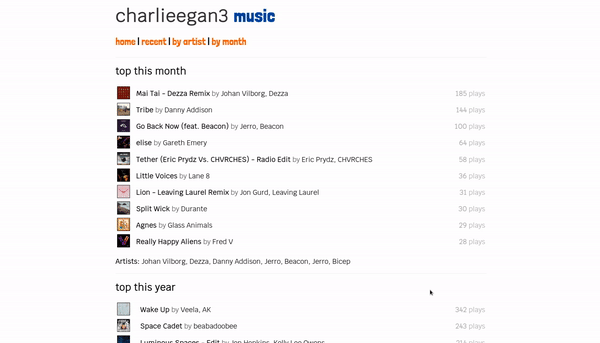

# charlieegan3-music

This contains the projects which manage the data and website at
[music.charlieegan3.com](https://music.charlieegan3.com).

The site is hosted on [Netlify](https://www.netlify.com/), the data which the
site presents is stored in [BigQuery](https://cloud.google.com/bigquery). This
data is updated using a scruffy Go app in [GitHub
Actions](https://github.com/features/actions).

This project is only for my own use and is kind of hacked together. You can
read about it in a [blog post
here](https://charlieegan3.com/blog/2018/11/20/how-i-learned-to-stop-worrying-and-build-my-own-lastfm).
